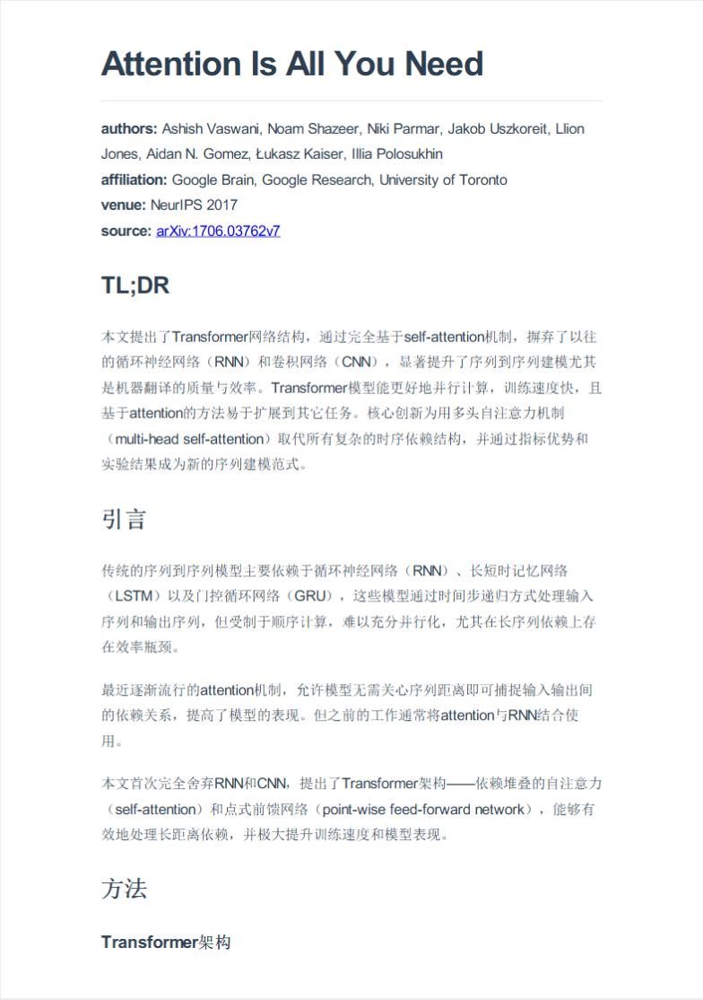
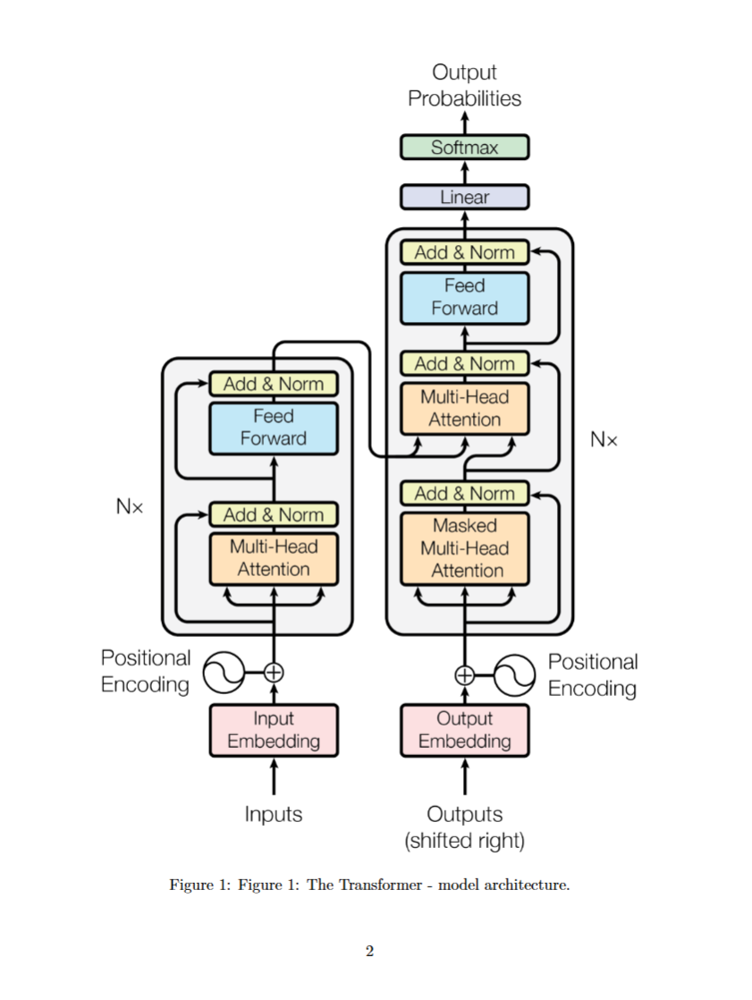

# Visual PDF Summary

🌐 [English Version](README.md) | [中文版](README_ZH.md)

Visual PDF Summary is an intelligent research paper briefing generation tool powered by Multimodal Large Language Models (LLMs).

Unlike traditional text-only summarization tools, this project deeply understands the layout structure of PDFs. It **automatically extracts figures and tables**, combining them with the capabilities of Vision-Language Models to generate a clear, logical, and illustrated academic report.

## ✨ Key Features

- **🖼️ Intelligent Visual Extraction**: It goes beyond simple screenshots. With built-in geometric algorithms based on `Shapely` and `PyMuPDF`, it automatically detects and crops figures, charts, and key areas while eliminating distracting elements.
- **🧠 Deep Multimodal Understanding**: Leveraging the visual understanding capabilities of LLMs, it reads paper screenshots and combines them with extracted illustrations to generate interpretations that are more accurate than pure text analysis.
- **📊 Illustrated Reports**: The generated reports automatically insert original figures at their citation positions, replacing dry text with rich visual context.

## 🛠️ Usage

### 1. Python Dependencies
Please ensure Python 3.8+ is installed. Run the following commands to install dependencies:

```bash
git clone https://github.com/ccrrkk/visual-pdf-summary.git
cd visual-pdf-summary
pip install -r requirements.txt
```

### 2. API Key Configuration
You need a valid LLM API Key to access the model services. Please obtain one from your provider's official website.

Once obtained, create a `.env` file in the project root directory with the following content:

```env
api_key=YOUR_API_KEY 
base_url=YOUR_BASE_URL  
model=gpt-4o               
```

### 3. Run the Program

Run the following command to generate a paper summary:

```bash
python reporter.py --pdf_path path/to/your/paper.pdf --output_dir output --language en
```

- `--pdf_path`: Path to the input PDF file (Required)
- `--output_dir`: Output directory (Default: `output`)
- `--language`: Language of the report, supports `zh` (Chinese) and `en` (English). (Default: `en`)

### 4. Modify Prompts (Optional)

If you need to customize the prompts, you can modify the `cn_prompt` and `en_prompt` variables in `prompt.py`.

## 💾 Output Example

Here is a sample report generated for the paper ["Attention Is All You Need"](https://arxiv.org/abs/1706.03762). You can view the full result [here](example/attention_is_all_your_need/report.pdf). Excerpts are shown below:

<center class="half">
    
</center>

## Acknowledgements

The PDF parsing code in this project references https://github.com/CosmosShadow/gptpdf, with improvements made to the image extraction algorithms.
