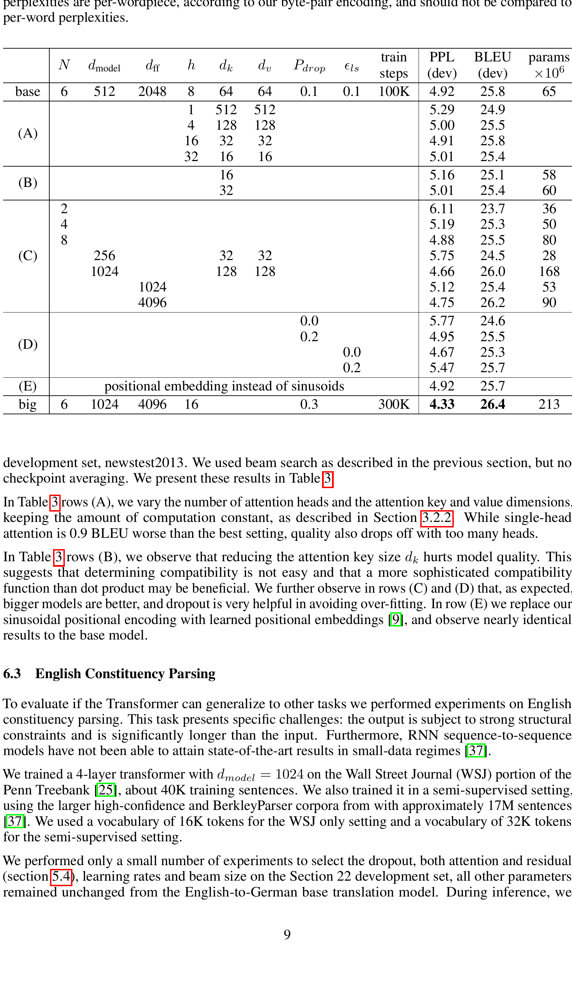

# Attention Is All You Need

**论文基本信息**  
- authors: Ashish Vaswani, Noam Shazeer, Niki Parmar, Jakob Uszkoreit, Llion Jones, Aidan N. Gomez, Łukasz Kaiser, Illia Polosukhin  
- affiliation: Google Brain, Google Research, University of Toronto  
- venue: 31st Conference on Neural Information Processing Systems (NeurIPS 2017)
- source: [arXiv:1706.03762v7](https://arxiv.org/abs/1706.03762)  

## TL;DR

本论文提出了Transformer模型，一种完全基于自注意力（self-attention）机制、无需循环（RNN）或卷积（CNN）结构的序列建模方法。Transformer极大提升了训练并行性及性能，并在机器翻译等任务上获得了卓越的效果，定义了大规模预训练语言模型的基础架构。

## 引言

序列到序列（sequence transduction）任务（如机器翻译、摘要等）传统依赖RNN（LSTM/GRU）或CNN架构，尽管取得了进步但依然受限于串行计算、长距离依赖建模能力不足等问题。近年来，注意力机制成为关键，使模型能够忽略符号间距离直接建模全局依赖性。本文提出Transformer模型——完全弃用递归和卷积，纯粹依赖多头自注意力（multi-head self-attention）机制处理输入输出间的全局依赖，同时极大提升训练并行性和效率，成为序列建模领域的重要突破。

## 方法

### Transformer 架构总览

Transformer由编码器（Encoder）和解码器（Decoder）两部分组成，分别堆叠若干相同的子层。每层主要由多头注意力机制和前馈神经网络（Feed-Forward Netwoks）组成，均配有残差连接和层归一化。

**模型结构如图所示：**

#### Encoder & Decoder 堆叠层  
- 编码器：6层，每层包含多头自注意力和前馈网络。
- 解码器：6层，每层包含掩码多头自注意力、编码器—解码器多头注意力及前馈网络。掩码实现自回归生成。

#### 残差连接与归一化  
每个子层输出都进行层归一化，并与输入作残差相加，缓解深层网络训练困难。

### Attention 机制详解

#### 缩放点积注意力（Scaled Dot-Product Attention）

公式如下：  
$$
\text{Attention}(Q, K, V) = \text{softmax}\left(\frac{Q K^T}{\sqrt{d_k}}\right)V
$$

其中 $Q, K, V$ 为 query, key, value，$d_k$为key的维数。

图解：

#### 多头注意力（Multi-Head Attention）

将 $Q, K, V$ 映射到不同子空间并行计算，然后拼接+线性变换。即：

$$
\text{MultiHead}(Q,K,V) = \text{Concat}(\text{head}_1,...,\text{head}_h) W^O \\
\text{where } \text{head}_i = \text{Attention}(QW_i^Q, KW_i^K, VW_i^V)
$$

这样模型能关注不同表示子空间，不同位置细粒度的信息。

#### 应用
- Encoder-decoder attention：解码器每层查询编码器全部输出，建模输入-输出相关性。
- Self-attention：编码器或解码器内部单层自我关注建模全局依赖。

### 前馈网络

每个注意力子层后接独立、位置无关的前馈网络：

$$
FFN(x) = \max(0, xW_1 + b_1) W_2 + b_2
$$

### 嵌入与位置编码

由于Transformer结构无递归或卷积，需引入位置编码（Positional Encoding）提供序列中token顺序信息。具体采用sine/cosine函数构建，按不同频率编码绝对位置信息：

$$
PE_{(pos,2i)} = \sin(pos/10000^{2i/d_{model}}) \\
PE_{(pos,2i+1)} = \cos(pos/10000^{2i/d_{model}})
$$

### 不同网络结构的复杂度对比

表格1总结了自注意力、循环、卷积各自的理论计算复杂度和最大路径长度：

## 实验

### 任务与数据

1. **机器翻译**：WMT 2014英德（EN-DE）、英法（EN-FR）大规模公开数据集。
    - 训练参考量级百万对
    - 评价指标：BLEU得分，训练复杂度（FLOPs）

### 主要实验设置

- 对比对象包括ByteNet、GNMT（Google神经翻译）、ConvS2S等主流模型；
- 主要实验在8块NVIDIA P100 GPU上进行，比传统RNN/CNN模型训练速度显著提升。

### 结果与性能分析

#### 核心结果

- Transformer（big配置）在英德任务上BLEU高达28.4，远超此前方法
- 在英法任务上也达到41.8。计算成本仅为GNMT等方法的1/4甚至更低

#### 消融与变体实验

实验还考察了层数、注意力头数、前馈层维度、位置编码方式等对性能的影响：

#### 英文成分句法分析（迁移学习能力验证）

## 总结与讨论

### 总结

- 提出了一种完全基于自注意力机制、去除RNN和CNN的Transformer模型，大幅提升了序列建模效率和效果。
- Transformer在大规模机器翻译任务上达到当时新SOTA，并验证了极强的迁移泛化能力。
- 核心是依赖多头注意力机制实现高效全局依赖建模，极大促进大规模预训练语言模型的发展。

### 局限性与未来方向

- 由于自注意力机制对序列长度的二次复杂度，极长序列处理上存在瓶颈；论文提出后续可通过局部注意力等方法改进。
- Transformer启发了更广泛的多模态（vision、audio）等领域，并为GPT、BERT等预训练模型打下基础。
- 未来可探讨高效变种、稀疏注意力、大规模多模态任务的泛化。

## 相关文献与实现

- 代码开源：[https://github.com/tensorflow/tensor2tensor](https://github.com/tensorflow/tensor2tensor)

**图示：部分关键可视化与注意力行为示例**

以上即为本论文的简报。如需更详细数学推导、完整实验细节请参考原文。