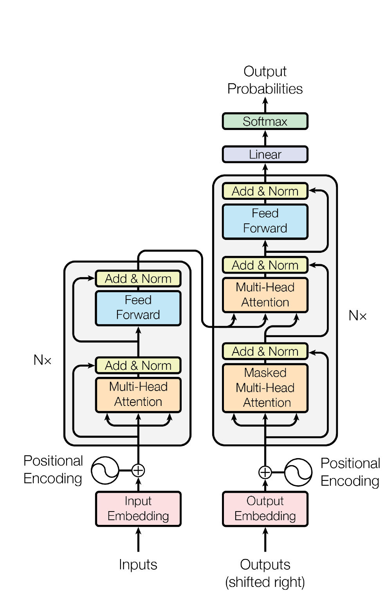
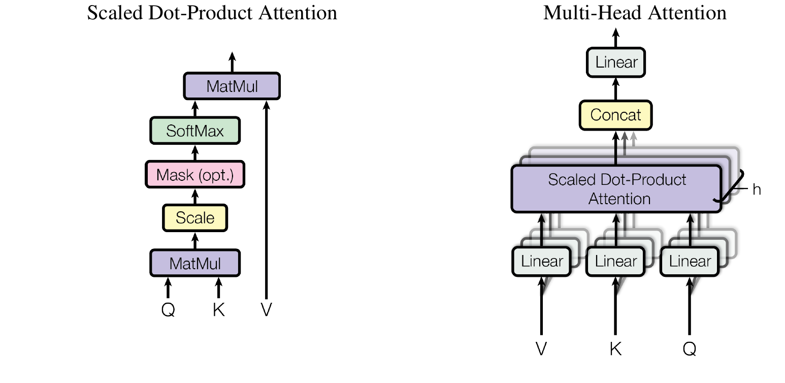
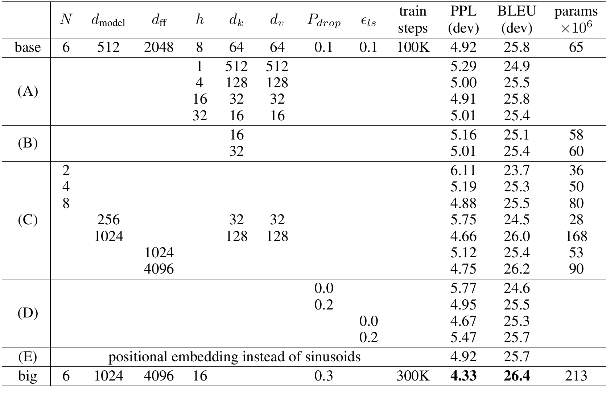
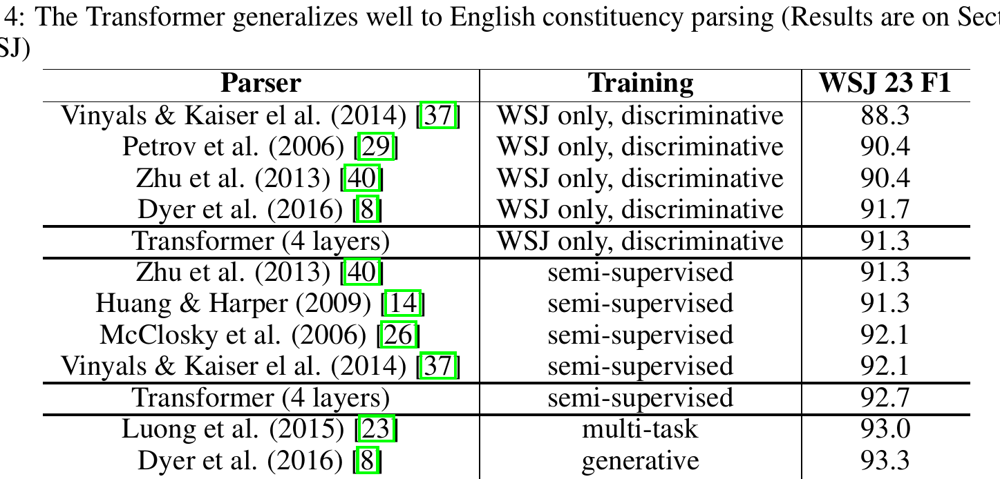
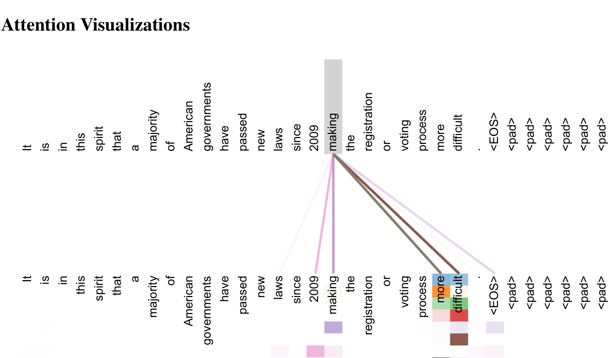

# Attention Is All You Need

**authors:** Ashish Vaswani, Noam Shazeer, Niki Parmar, Jakob Uszkoreit, Llion Jones, Aidan N. Gomez, Łukasz Kaiser, Illia Polosukhin  
**affiliation:** Google Brain, Google Research, University of Toronto  
**venue:** NeurIPS 2017  
**source:** [arXiv:1706.03762v7](https://arxiv.org/abs/1706.03762)  

## TL;DR

本文提出了Transformer网络结构，通过完全基于self-attention机制，摒弃了以往的循环神经网络（RNN）和卷积网络（CNN），显著提升了序列到序列建模尤其是机器翻译的质量与效率。Transformer模型能更好地并行计算，训练速度快，且基于attention的方法易于扩展到其它任务。核心创新为用多头自注意力机制（multi-head self-attention）取代所有复杂的时序依赖结构，并通过指标优势和实验结果成为新的序列建模范式。

## 引言

传统的序列到序列模型主要依赖于循环神经网络（RNN）、长短时记忆网络（LSTM）以及门控循环网络（GRU），这些模型通过时间步递归方式处理输入序列和输出序列，但受制于顺序计算，难以充分并行化，尤其在长序列依赖上存在效率瓶颈。

最近逐渐流行的attention机制，允许模型无需关心序列距离即可捕捉输入输出间的依赖关系，提高了模型的表现。但之前的工作通常将attention与RNN结合使用。

本文首次完全舍弃RNN和CNN，提出了Transformer架构——依赖堆叠的自注意力（self-attention）和点式前馈网络（point-wise feed-forward network），能够有效地处理长距离依赖，并极大提升训练速度和模型表现。

## 方法

### Transformer架构

Transformer由一个Encoder-Decoder结构组成，全部基于self-attention和前馈网络构建。Encoder和Decoder均包含多层（通常为6层），每层都有multi-head attention与前馈子层。Decoder层则额外使用masked multi-head attention以实现自回归生成。

#### 模型架构总览

如下图所示，Transformer架构完全依赖attention作为核心连接机制：

**架构要点**：
- **Encoder**：每一层包括多头自注意力、前馈网络、add & norm。
- **Decoder**：除了encoder结构，额外包含masked multi-head attention防止泄露未来信息，并与encoder输出结合（cross-attention）。
- **位置编码（Positional Encoding）**：用于保留序列顺序信息，以弥补attention机制中无序结构。

#### Attention机制

注意力函数定义为映射一个query及一组key-value对到输出，具体采用Scaled Dot-Product Attention：

$$
Attention(Q, K, V) = \text{softmax}\left( \frac{QK^T}{\sqrt{d_k}} \right)V
$$

其中，$Q$（Query），$K$（Key），$V$（Value）均为向量，$d_k$为Key向量维度。

#### Multi-Head Attention

多个attention头并行计算，提升模型捕捉不同语义和结构信息能力。每个头独立计算attention后其输出串联（concat）起来，再通过线性变换。

**multi-head attention公式如下**：
$$
MultiHead(Q, K, V) = \text{Concat}(head_1, ..., head_h)W^O
$$
其中 $head_i = Attention(QW_i^Q, KW_i^K, VW_i^V)$。

#### 前馈神经网络（Feed-Forward Networks）

每层attention后接一个两层前馈网络，形式为：
$$
FFN(x) = \max(0, xW_1 + b_1)W_2 + b_2
$$

#### 位置编码

通过正弦和余弦函数生成不同频率的向量，加到输入的embedding上，以确保模型能区分不同序列位置。

#### 各层复杂度与路径长度对比

Transformer中的self-attention机制能够在常数步并行完成操作，而RNN需要依次序列处理：

## 实验

### 数据集与设置

- WMT 2014 英德（EN-DE）、英法（EN-FR）机器翻译任务
- Penn Treebank用于英语语法 constituency parsing
- 训练硬件为8块NVIDIA P100 GPU

### 模型与评价指标

- BLEU分数（机器翻译质量）
- 训练复杂度（FLOPs）

### 结果

#### 翻译任务结果（BLEU与训练复杂度）

Transformer（base model）与Transformer（big）在BLEU分数和训练效率上均大幅优于现有最优模型：

#### 架构变体影响

模型参数、attention头数等对性能的影响如下表所示：

#### 语法分析任务结果

Transformer也能迁移到英语 constituency parsing 任务，取得接近或超过有监督和半监督SOTA：

#### attention可视化

Transformer的attention机制能捕捉长距离依赖，模型对输入序列结构有很好的解释性：

## 总结与讨论

本文提出了Transformer序列建模框架，完全基于多头自注意力机制，实现高效并行、易扩展的架构。实验结果表明，在大规模机器翻译任务上，Transformer能以更低训练成本取得SOTA性能；在语法分析等其它NLP任务上同样具备强大的泛化能力。

Transformer的优势体现在：
- 更优的长距离依赖建模能力
- 性能、效率双提升
- 可视化解释性好

局限性与未来工作：
- 对于超长序列，self-attention复杂度较高，可进一步研究局部/稀疏attention
- Transformer的无序结构可能在某些任务中需更强的位置编码设计
- 模型可推广至多模态（视觉、音频等）和更广泛序列处理任务

本文奠定了后续BERT、GPT等pretrained transformer模型的理论基础，是NLP和深度学习领域里极具里程碑意义的工作。

## 参考代码

代码实现可参考：[https://github.com/tensorflow/tensor2tensor](https://github.com/tensorflow/tensor2tensor)

---